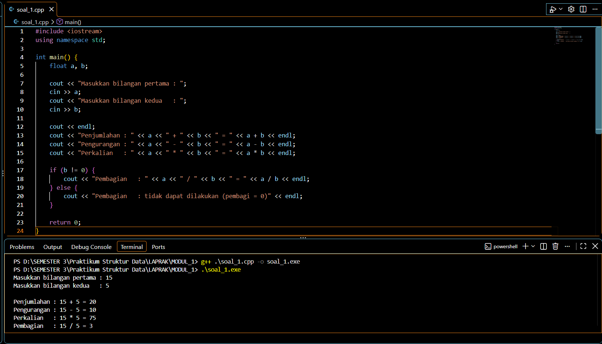
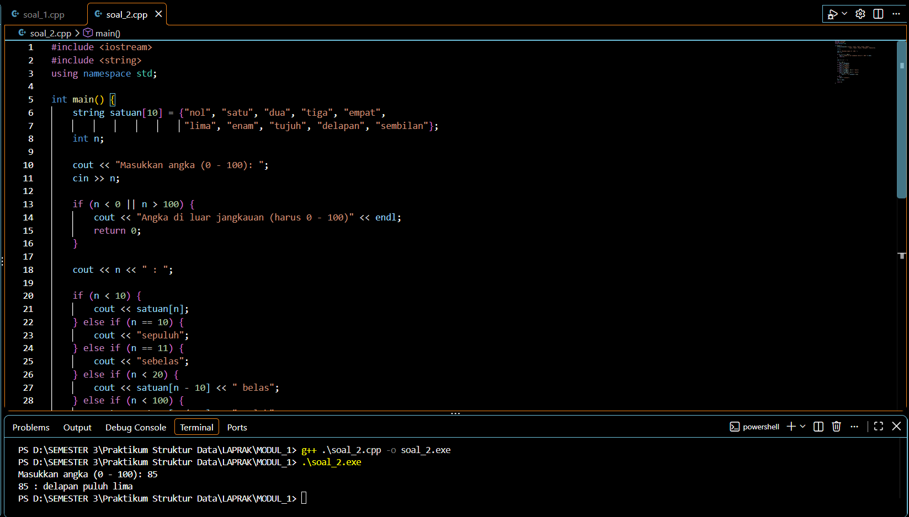
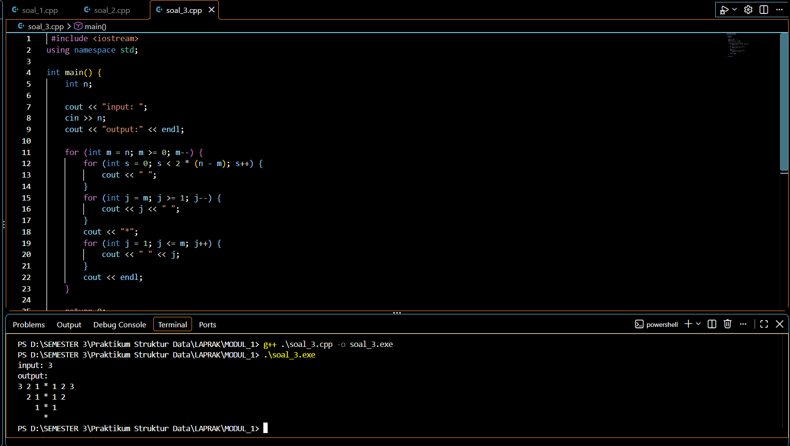

<div align="center">

# Laporan Praktikum Modul 1 - Code Blocks IDE & Pengenalan Bahasa C++ (Bagian Pertama)

**Mata Kuliah Struktur Data**

**[AHMAD LUTHFI HABIBIE] - [109082500190]**

**[KELAS, S1IF-13-01]**

</div>

---

## Unguided

### Soal 1

> Buatlah program yang menerima input-an dua buah bilangan bertipe float, kemudian memberikan output-an hasil penjumlahan, pengurangan, perkalian, dan pembagian dari dua bilangan tersebut.

#### unguided1.cpp

```cpp
#include <iostream>
using namespace std;

int main() {
    float a, b;

    cout << "Masukkan bilangan pertama : ";
    cin >> a;
    cout << "Masukkan bilangan kedua   : ";
    cin >> b;

    cout << endl;
    cout << "Penjumlahan : " << a << " + " << b << " = " << a + b << endl;
    cout << "Pengurangan : " << a << " - " << b << " = " << a - b << endl;
    cout << "Perkalian   : " << a << " * " << b << " = " << a * b << endl;

    if (b != 0) {
        cout << "Pembagian   : " << a << " / " << b << " = " << a / b << endl;
    } else {
        cout << "Pembagian   : tidak dapat dilakukan (pembagi = 0)" << endl;
    }

    return 0;
}
```

#### Output Unguided 1 :

```text
Masukkan bilangan pertama : 10.5
Masukkan bilangan kedua   : 4

Penjumlahan : 10.5 + 4 = 14.5
Pengurangan : 10.5 - 4 = 6.5
Perkalian   : 10.5 * 4 = 42
Pembagian   : 10.5 / 4 = 2.625
```



#### Penjelasan

Program mendeklarasikan dua variabel bertipe `float` yaitu `a` dan `b`. Nilai keduanya dibaca dari keyboard menggunakan `cin`. Setelah itu program menghitung penjumlahan (`+`), pengurangan (`-`), perkalian (`*`), dan pembagian (`/`), lalu menampilkan hasilnya dengan `cout`.

Sebelum melakukan pembagian, program memeriksa dengan `if (b != 0)` agar tidak terjadi pembagian dengan nol. Jika `b` bernilai 0, program menampilkan pesan bahwa pembagian tidak dapat dilakukan.

---

### Soal 2

> Buatlah sebuah program yang menerima masukan angka dan mengeluarkan output nilai angka tersebut dalam bentuk tulisan. Angka yang akan di-input-kan user adalah bilangan bulat positif mulai dari 0 s.d 100.
>
> Contoh: `79 : tujuh puluh sembilan`

#### unguided2.cpp

```cpp
#include <iostream>
#include <string>
using namespace std;

int main() {
    string satuan[10] = {"nol", "satu", "dua", "tiga", "empat",
                         "lima", "enam", "tujuh", "delapan", "sembilan"};
    int n;

    cout << "Masukkan angka (0 - 100): ";
    cin >> n;

    if (n < 0 || n > 100) {
        cout << "Angka di luar jangkauan (harus 0 - 100)" << endl;
        return 0;
    }

    cout << n << " : ";

    if (n < 10) {
        cout << satuan[n];
    } else if (n == 10) {
        cout << "sepuluh";
    } else if (n == 11) {
        cout << "sebelas";
    } else if (n < 20) {
        cout << satuan[n - 10] << " belas";
    } else if (n < 100) {
        cout << satuan[n / 10] << " puluh";
        if (n % 10 != 0) {
            cout << " " << satuan[n % 10];
        }
    } else {
        cout << "seratus";
    }
    cout << endl;

    return 0;
}
```

#### Output Unguided 2 :

Contoh 1 (angka 79):

```text
Masukkan angka (0 - 100): 79
79 : tujuh puluh sembilan
```

Contoh 2 (angka 15):

```text
Masukkan angka (0 - 100): 15
15 : lima belas
```

Contoh 3 (angka 100):

```text
Masukkan angka (0 - 100): 100
100 : seratus
```



#### Penjelasan

Program menyimpan kata untuk angka 0 sampai 9 dalam array `satuan`. Angka yang diinput disimpan di variabel `n`, lalu diperiksa apakah berada pada rentang 0 sampai 100.

Pengubahan angka menjadi tulisan menggunakan struktur kondisional `if - else if - else` dengan aturan berikut:

1. `n < 10` : langsung diambil dari array `satuan` (nol sampai sembilan).
2. `n == 10` : "sepuluh" dan `n == 11` : "sebelas" (kasus khusus dalam bahasa Indonesia).
3. `12 <= n <= 19` : `satuan[n - 10]` ditambah kata "belas" (contoh: 15 menjadi "lima belas").
4. `20 <= n <= 99` : `satuan[n / 10]` ditambah kata "puluh", lalu jika `n % 10 != 0` ditambah `satuan[n % 10]` (contoh: 79 menjadi "tujuh puluh sembilan").
5. `n == 100` : "seratus".

Operator `/` digunakan untuk mengambil digit puluhan dan operator `%` (modulus) untuk mengambil digit satuan.

---

### Soal 3

> Buatlah program yang dapat memberikan input dan output seperti pada Gambar 1.25 (Mirror).

#### unguided3.cpp

```cpp
#include <iostream>
using namespace std;

int main() {
    int n;

    cout << "input: ";
    cin >> n;
    cout << "output:" << endl;

    for (int m = n; m >= 0; m--) {
        for (int s = 0; s < 2 * (n - m); s++) {
            cout << " ";
        }
        for (int j = m; j >= 1; j--) {
            cout << j << " ";
        }
        cout << "*";
        for (int j = 1; j <= m; j++) {
            cout << " " << j;
        }
        cout << endl;
    }

    return 0;
}
```

#### Output Unguided 3 :

```text
input: 3
output:
3 2 1 * 1 2 3
  2 1 * 1 2
    1 * 1
      *
```



#### Penjelasan

Program membaca bilangan `n`, kemudian mencetak pola secara bertahap dari baris dengan `m = n` sampai `m = 0` menggunakan perulangan `for` yang menurun. Setiap baris terdiri dari tiga bagian:

1. Spasi di depan sebanyak `2 * (n - m)` agar pola rata tengah (bentuk segitiga terbalik).
2. Angka `m` menurun sampai 1 (`m, m-1, ..., 1`), masing-masing diikuti spasi, lalu tanda `*`.
3. Angka 1 naik sampai `m` (`1, 2, ..., m`), masing-masing didahului spasi. Bagian ini merupakan cerminan (mirror) dari bagian kiri.

Pada baris terakhir (`m = 0`) kedua bagian angka tidak tercetak sehingga hanya tersisa tanda `*`.

---

## Kesimpulan

Pada praktikum Modul 1 ini telah dipelajari penggunaan Code Blocks IDE serta dasar bahasa C++, meliputi tipe data dan variabel, operator aritmatika, operator input/output (`cin` dan `cout`), struktur kondisional (`if - else`), dan perulangan (`for`). Ketiga program pada latihan berhasil dibuat dan dijalankan sesuai dengan yang diminta soal.

---

## Daftar Pustaka

[1] Laboratorium Informatika, Fakultas Informatika, Telkom University, *Modul Praktikum Struktur Data - Modul 1: Code Blocks IDE & Pengenalan Bahasa C++ (Bagian Pertama)*, Telkom University, Bandung.

[2] L. J. E. Dewi, "Media Pembelajaran Bahasa Pemrograman C++," *Jurnal Pendidikan Teknologi dan Kejuruan*, vol. 7, no. 1, 2012. DOI: [10.23887/jptk.v7i1.31](https://doi.org/10.23887/jptk.v7i1.31)

[3] I. Ramadhana dan B. Sujatmiko, "Pengembangan Aplikasi Kamus Bahasa Pemrograman C++ Berbasis Android untuk Meningkatkan Kompetensi Kognitif Mata Kuliah Struktur Data," *IT-Edu: Jurnal Information Technology and Education*, vol. 3, no. 1, hlm. 85-92, 2018. DOI: [10.26740/it-edu.v3i1.24755](https://doi.org/10.26740/it-edu.v3i1.24755)

[4] A. Ma'arif, *Buku Ajar Dasar Pemrograman C++*, Program Studi Teknik Elektro, Fakultas Teknologi Industri, Universitas Ahmad Dahlan, t.t. Tersedia: https://eprints.uad.ac.id/32726/1/Dasar%20Pemrograman%20Bahasa%20C++.pdf

[5] B. Stroustrup, *The C++ Programming Language*, 4th ed., Addison-Wesley, 2013.

[6] "Code::Blocks - The open source, cross-platform IDE." https://www.codeblocks.org (diakses 29 September 2026).

[7] "C++ reference." cppreference.com. https://en.cppreference.com (diakses 29 September 2026).

